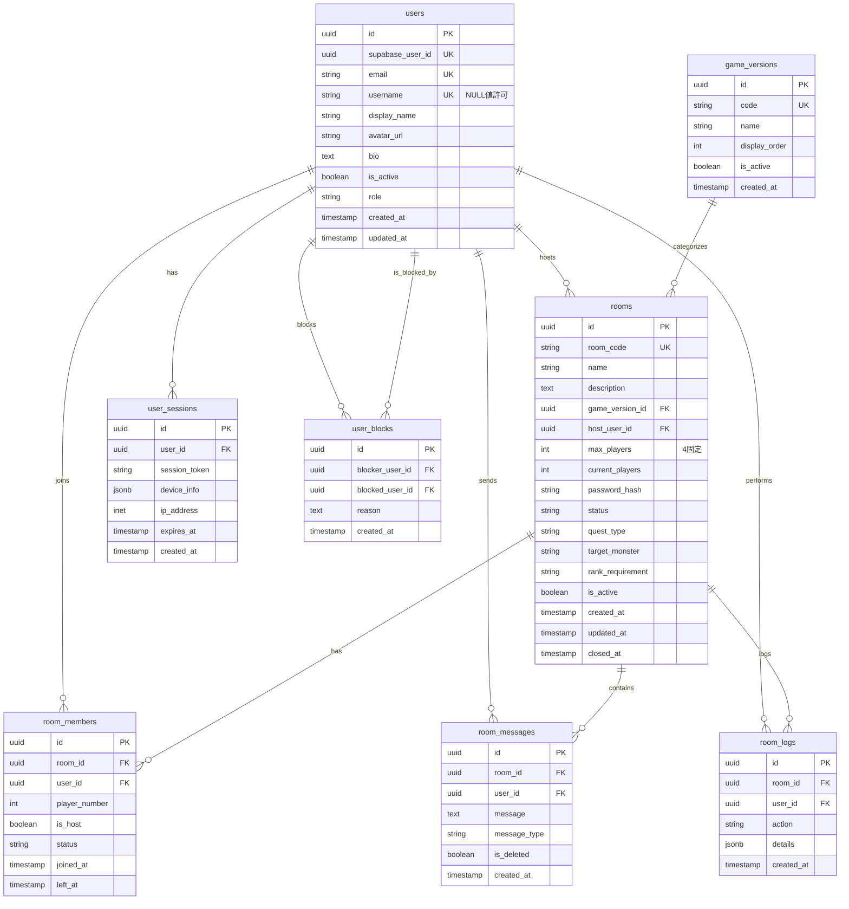

# ER図（Entity Relationship Diagram）

## 概要

モンスターハンターポータブルシリーズのアドホックパーティルーム管理システムのデータモデルとエンティティ間の関係を示すドキュメントです。

## ER図

## エンティティ関係の詳細

### 1. ユーザー関連

#### users ↔ rooms（1対多）
- 1人のユーザーは複数のルームをホストできる
- 1つのルームは必ず1人のホストユーザーを持つ
- 関係性：`rooms.host_user_id` → `users.id`

#### users ↔ room_members（1対多）
- 1人のユーザーは複数のルームに参加できる
- ルームメンバーは必ず1人のユーザーに紐づく
- 関係性：`room_members.user_id` → `users.id`
- 制約：同一ルームに同じユーザーがアクティブ状態で複数存在できない

#### users ↔ room_messages（1対多）
- 1人のユーザーは複数のメッセージを送信できる
- 各メッセージは必ず1人の送信者を持つ
- 関係性：`room_messages.user_id` → `users.id`

#### users ↔ user_sessions（1対多）
- 1人のユーザーは複数のセッションを持てる（複数デバイス対応）
- 各セッションは必ず1人のユーザーに紐づく
- 関係性：`user_sessions.user_id` → `users.id`
- カスケード削除：ユーザー削除時にセッションも削除

#### users ↔ user_blocks（多対多）
- ユーザーは他の複数のユーザーをブロックできる
- ユーザーは他の複数のユーザーからブロックされる可能性がある
- 関係性：
  - `user_blocks.blocker_user_id` → `users.id`（ブロックする側）
  - `user_blocks.blocked_user_id` → `users.id`（ブロックされる側）

### 2. ルーム関連

#### game_versions ↔ rooms（1対多）
- 1つのゲームバージョンには複数のルームが存在できる
- 各ルームは必ず1つのゲームバージョンに属する
- 関係性：`rooms.game_version_id` → `game_versions.id`

#### rooms ↔ room_members（1対多）
- 1つのルームには複数のメンバーが参加できる（最大4人）
- 各メンバーシップは必ず1つのルームに属する
- 関係性：`room_members.room_id` → `rooms.id`
- カスケード削除：ルーム削除時にメンバー情報も削除

#### rooms ↔ room_messages（1対多）
- 1つのルームには複数のメッセージが存在できる
- 各メッセージは必ず1つのルームに属する
- 関係性：`room_messages.room_id` → `rooms.id`
- カスケード削除：ルーム削除時にメッセージも削除

#### rooms ↔ room_logs（1対多）
- 1つのルームには複数のログエントリが存在できる
- 各ログは必ず1つのルームに属する
- 関係性：`room_logs.room_id` → `rooms.id`
- カスケード削除：ルーム削除時にログも削除

### 3. その他の関係

#### users ↔ room_logs（0対多）
- ログはユーザーのアクションを記録（NULLの場合はシステムアクション）
- 関係性：`room_logs.user_id` → `users.id`
- SET NULL：ユーザー削除時にログのuser_idはNULLになる

## ビジネスロジックと制約

### ルーム参加制約
1. **人数制限**
   - ルームの`current_players`は`max_players`を超えない
   - `max_players`は固定で4人（MHPのアドホックパーティの仕様）

2. **ホスト制約**
   - ルームには必ず1人のホストが存在
   - ホストはルームメンバーにも登録される（`is_host = true`）
   - ホストが退出する場合、別のメンバーにホスト権限が移譲される

3. **ゲームバージョン制約**
   - 同じゲームバージョンのルームにのみ参加可能
   - ゲームバージョンの互換性はアプリケーション層で管理

### ユーザーブロック制約
1. **相互作用制限**
   - ブロックされたユーザーはブロックしたユーザーのルームに参加不可
   - ブロックされたユーザーのメッセージは表示されない

2. **自己ブロック防止**
   - ユーザーは自分自身をブロックできない

### 認証アクセス制約
1. **ページアクセス制限**
   - トップページ（ルーム一覧）: 認証不要
   - ルーム詳細、参加、チャットなど全ての機能: 認証必要

2. **Supabase Auth連携**
   - ユーザー情報はSupabase Authで統一管理（メール/PW、Google OAuth共通）
   - `supabase_user_id`でアプリ内ユーザーと連携
   - Google OAuthはSupabase Authの機能として実装

### メッセージ制約
1. **メッセージタイプ**
   - `chat`: 通常のチャットメッセージ
   - `system`: システムメッセージ
   - `join`: 参加通知
   - `leave`: 退出通知

2. **削除制約**
   - メッセージは論理削除（`is_deleted = true`）
   - 物理削除は行わない

## データ整合性の保証

### トランザクション管理
1. **ルーム作成時**
   - roomsテーブルへの挿入
   - room_membersテーブルへのホスト登録
   - room_logsへの作成ログ記録
   → 全て同一トランザクション内で実行

2. **ルーム参加時**
   - room_membersテーブルへの挿入
   - roomsテーブルのcurrent_players更新
   - room_messagesへのシステムメッセージ挿入
   - room_logsへの参加ログ記録
   → 全て同一トランザクション内で実行

### 参照整合性
- 全ての外部キーに適切な制約を設定
- カスケード削除は慎重に設定（データ保持が必要な場合はSET NULL）
- ユニーク制約で重複を防止

## パフォーマンス最適化

### インデックス設計
1. **主要な検索パターン**
   - アクティブなルーム一覧（game_version_id, status, is_active）
   - ユーザーの参加ルーム（user_id, status）
   - ルーム内メッセージ（room_id, created_at DESC）

2. **結合最適化**
   - 外部キーカラムには自動的にインデックスが作成される
   - 頻繁な結合パターンに応じて複合インデックスを追加

### データアーカイブ
- 古いroom_messagesとroom_logsは定期的にアーカイブ
- クローズから一定期間経過したルームデータの移行
