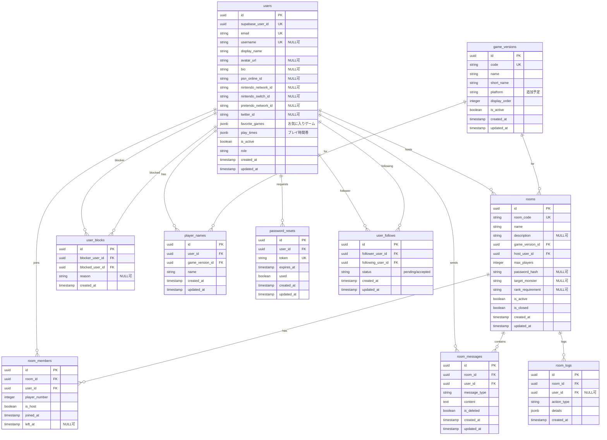

# ER図（Entity Relationship Diagram）

## 概要
MonHubのデータベース構造を示すER図です。

## テーブル関係図

## インデックス

### users
- `idx_users_supabase_user_id` (supabase_user_id)
- `idx_users_email` (email)
- `idx_users_username` (username)
- `idx_users_is_active` (is_active)

### game_versions
- `idx_game_versions_code` (code)
- `idx_game_versions_is_active` (is_active)
- `idx_game_versions_display_order` (display_order)

### rooms
- `idx_rooms_room_code` (room_code)
- `idx_rooms_game_version_id` (game_version_id)
- `idx_rooms_host_user_id` (host_user_id)
- `idx_rooms_is_active` (is_active)
- `idx_rooms_is_closed` (is_closed)
- `idx_rooms_created_at` (created_at)

### room_members
- `idx_room_members_room_id` (room_id)
- `idx_room_members_user_id` (user_id)
- `idx_room_members_room_user` (room_id, user_id)
- `idx_room_members_left_at` (left_at)

### room_messages
- `idx_room_messages_room_id` (room_id)
- `idx_room_messages_user_id` (user_id)
- `idx_room_messages_created_at` (created_at)
- `idx_room_messages_is_deleted` (is_deleted)

### room_logs
- `idx_room_logs_room_id` (room_id)
- `idx_room_logs_user_id` (user_id)
- `idx_room_logs_action_type` (action_type)
- `idx_room_logs_created_at` (created_at)

### user_blocks
- `idx_user_blocks_blocker_user_id` (blocker_user_id)
- `idx_user_blocks_blocked_user_id` (blocked_user_id)
- `idx_user_blocks_blocker_blocked` (blocker_user_id, blocked_user_id)

### player_names
- `idx_player_names_user_game` (user_id, game_version_id)

### password_resets
- `idx_password_resets_user_id` (user_id)
- `idx_password_resets_token` (token)
- `idx_password_resets_expires_at` (expires_at)

### user_follows
- `idx_user_follows_follower_user_id` (follower_user_id)
- `idx_user_follows_following_user_id` (following_user_id)
- `idx_user_follows_follower_following` (follower_user_id, following_user_id)
- `idx_user_follows_status` (status)